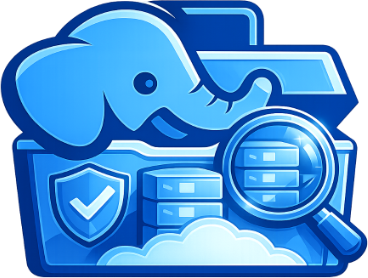

<p align="center">
  
</p>

<h1 align="center">ObjectStoreViewer</h1>

<p align="center">
  <strong>See what is really present in your PostgreSQL backup repository.</strong><br>
  Read-only, format-aware, and honest when the evidence is incomplete.
</p>

<p align="center">
  <a href="https://github.com/fyannk/pgObjectStoreViewer/actions/workflows/ci.yml"></a>
  <a href="https://github.com/fyannk/pgObjectStoreViewer/actions/workflows/docs.yml"></a>
  <a href="https://scorecard.dev/viewer/?uri=github.com/fyannk/pgObjectStoreViewer"></a>
  <a href="https://www.bestpractices.dev/projects/13921"></a>
  <a href="LICENSE"></a>
  
</p>

ObjectStoreViewer is a small web application for inspecting PostgreSQL backup
repositories in S3, Azure Blob Storage, and GCS. It turns object-store metadata
into a bounded inventory, a Barman backup catalog, WAL continuity diagnostics,
and conservative observed recovery coverage.

> [!IMPORTANT]
> ObjectStoreViewer reports **structural evidence**. It does not prove that a
> restore will succeed.

## ✨ Why use it?

- **Read-only by construction** — the application can list, inspect, and read
  bounded metadata; it has no upload, delete, restore, or mutation surface.
- **Useful at a glance** — see completed, running, failed, malformed, missing,
  or unsupported backups without digging through object keys by hand.
- **WAL-aware** — inspect compact WAL ranges, timeline history, duplicates,
  partial files, and candidate or confirmed gaps.
- **Honest uncertainty** — incomplete, stale, truncated, or unsupported
  evidence stays `unknown`; it never quietly becomes healthy.
- **Cloud-neutral** — the same evidence model is used over S3, Azure, and GCS.

## 🧩 What is available?

| Capability | Status |
|---|---|
| Barman Cloud inventory, backup catalog, WAL and timelines | ✅ Available |
| S3, Azure Blob Storage, and GCS adapters | ✅ Available |
| Standalone web dashboard | ✅ Available |
| pgConsole sidecar evidence producer | 🧪 Integration preview |
| pgBackRest catalog and dependency semantics | 🚧 Planned |
| Raw backup download or restore operations | ⛔ Not provided |

## 🚀 Quick start

You need Go 1.26+, `make`, a repository root, and credentials restricted to
**list/get** operations.

```bash
git clone https://github.com/fyannk/pgObjectStoreViewer.git
cd pgObjectStoreViewer
make build

REPOSITORY_FORMAT=barman-cloud \
PROVIDER=s3 \
DESTINATION_PATH=s3://example-backups/repository \
AWS_REGION=eu-west-1 \
./bin/objectstoreviewer
```

Then open [http://localhost:3000](http://localhost:3000).

| URL | Purpose |
|---|---|
| `/` | Backup inventory and evidence summary |
| `/wals` | Searchable Barman WAL evidence |
| `/healthz` | Process liveness |
| `/readyz` | Configuration and recent store reachability |

The example uses the AWS workload-identity chain. Static credentials are
accepted only through mounted files; see the
[configuration guide](web/docs/operations/configuration.md).

### Other providers

Only the provider coordinates change:

```bash
# Azure
PROVIDER=azure
DESTINATION_PATH=azure://backup-container/repository

# GCS
PROVIDER=gcs
DESTINATION_PATH=gs://backup-bucket/repository
```

Provider-specific identity options are documented in
[Configuration](web/docs/operations/configuration.md#provider-credentials).

## 📦 Run it as a container

Versioned, multi-architecture images are published to GitHub Container
Registry with SBOM and provenance attestations:

```bash
docker pull ghcr.io/fyannk/pgobjectstoreviewer:v0.1.1
```

The [latest release](https://github.com/fyannk/pgObjectStoreViewer/releases/latest)
also provides Linux amd64/arm64 binaries, checksums, an SPDX SBOM, license
inventory, vulnerability report, and the immutable image digest.

For Kubernetes, adapt the hardened
[`deploy/kubernetes-example.yaml`](deploy/kubernetes-example.yaml) manifest and
its read-only policies under [`deploy/policies/`](deploy/policies/).

> [!WARNING]
> The standalone application provides no authentication or TLS. Put it behind
> an authentication proxy and an operator-managed network boundary. Never
> expose its port directly.

## 📚 Documentation

The details live in the **[documentation site](https://fyannk.github.io/pgObjectStoreViewer/)**:

- [Getting started](web/docs/tutorials/getting-started.md)
- [Installation](web/docs/operations/installation.md)
- [Evidence model](web/docs/overview/evidence-model.md)
- [Security and trust boundary](web/docs/operations/security.md)
- [Configuration reference](web/docs/reference/configuration-variables.md)
- [pgConsole sidecar](web/docs/operations/sidecar.md)
- [Roadmap](web/docs/roadmap.md)

## 🤝 Contributing

Bug reports, format edge cases, fixtures, documentation fixes, and pull
requests are welcome. Start with:

```bash
make test       # fast, hermetic unit suite
make test-fuzz  # bounded fuzzing of untrusted metadata and cursors
make check      # complete non-Docker verification
make docs       # type-check and build the documentation site
```

Docker-backed provider, scale, and restricted-runtime checks are described in
the [verification guide](web/docs/reference/checks.md). Read
[`CONTRIBUTING.md`](CONTRIBUTING.md) before changing behavior, and note that
participation is governed by the
[Code of Conduct](CODE_OF_CONDUCT.md).

## 🔐 Security

Found a vulnerability? **Do not open a public issue.** Report it privately
through
[GitHub Security Advisories](https://github.com/fyannk/pgObjectStoreViewer/security/advisories/new).
[`SECURITY.md`](SECURITY.md) covers supported versions, what is in and out of
scope, and how to verify the provenance of what you run.

## 📄 License

ObjectStoreViewer is available under the
[Apache License 2.0](LICENSE).
