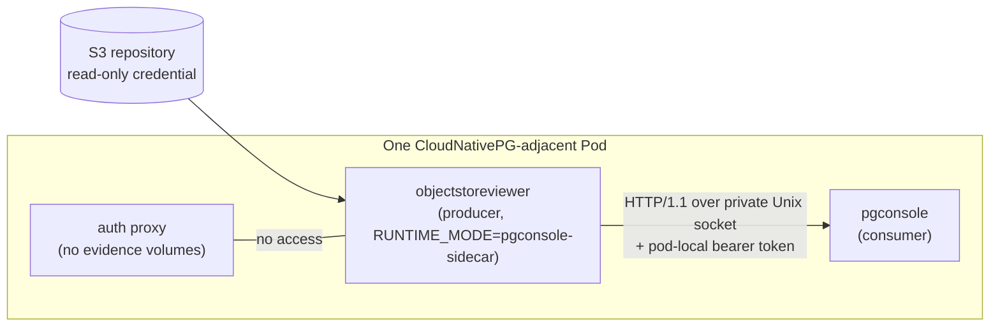

# The evidence channel

The sidecar producer exists so pgConsole can show repository evidence without
re-implementing it, and without either project inheriting the other's
dependencies.

## The boundary



Responsibilities do not overlap:

| Owner | Responsibility |
|---|---|
| ObjectStoreViewer | scanning, format semantics, evidence states, the wire vocabulary, the socket lifecycle |
| pgConsole | consuming and displaying the evidence; it holds the only Kubernetes API token |
| pgtoolbox | composing the Pod, creating the socket and token volumes, generating the token |

## Why a Unix socket

The transport is HTTP/1.1 over `/var/run/objectstoreviewer/evidence.sock`. The
bearer token authenticates the *caller*; the fixed socket path — in a volume
mounted only into the two intended containers — authenticates the *server
boundary*. Loopback TCP, cluster Services, and non-local sockets are not
accepted, so no NetworkPolicy mistake can expose the channel and the auth proxy
cannot reach it at all.

The producer refuses a symlink or non-socket at the path, and removes a stale
socket only after a dial confirms nothing is listening. See the [required
filesystem profile](../operations/sidecar.md#required-filesystem-profile).

## The dependency-light module

The wire vocabulary lives in a separate Go module,
`github.com/fyannk/pgObjectStoreViewer/api`, which imports **no** main
ObjectStoreViewer package, cloud SDK, compression library, repository parser,
HTTP server, or credential implementation. `make check-api` asserts
that it has zero external module dependencies.

It provides:

- the exact health, readiness, snapshot, error, and Barman collection types;
- conservative validators for states, nullable evidence, deterministic order,
  bounds, and the initial S3/Barman profile;
- unknown-details-tag handling that **discards** unrecognized payloads;
- the shared S3 canonicalization and destination fingerprint algorithm, with
  cross-project golden vectors;
- a generated Draft 2020-12 `schema.json`; and
- deterministic JSON wire goldens.

The main module's provider-free `internal/evidenceapi` projects its validated
immutable inventory into those types. It stays outside the module so the
cross-project contract can never import a scanner, a parser, or a runtime.

## Immutable publication and pagination

A publication is immutable once visible. Collections are cursor-paginated, and a
cursor is bound to a publication identity: a reader either finishes a collection
consistently within one generation, or is told the publication changed — it can
never silently interleave two generations. Cursors are opaque, bounded to
4096 bytes, process-local, and unrelated to the bearer token.

## Identity and correlation

A snapshot carries the CNPG namespace, the immutable Cluster UID, an optional
display name, and a destination fingerprint derived by the shared
canonicalization algorithm. Correlation is **observed-UID-only**: the producer
never reads the Kubernetes API, so it reports the identity it was configured
with and lets the consumer decide whether that matches the cluster it is
displaying.

## Compatibility

`v1alpha1` is additive-only within the version: new fields may appear, and a
consumer must ignore what it does not recognize. Unrecognized typed-details tags
are discarded rather than guessed at. A semantic version tag, a pgConsole
consumer, a pgtoolbox Pod profile, and a listed runtime pair belong to
cross-project integration — the executable producer alone does not claim a
qualified or shippable pair.

## Verification

```bash
make check-api       # module dependency boundary and generated drift
make test            # schema, goldens, projection, channel, runtime, and probe
make test-stress     # repeat lifecycle-sensitive cases under the race detector
make test-container  # exercise the real image under restricted profiles
```

The wire details are in the [evidence API
reference](../reference/evidence-api.md) and its [resource
reference](../reference/evidence-api-resources.md); the reasoning behind the
channel is in [Decisions](decisions.md).
