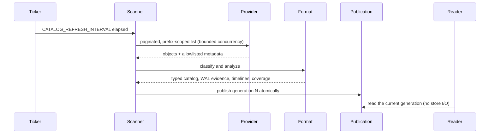

# Scanning and publication

## The cycle



Two properties matter more than the mechanics:

**Readers never touch the store.** A page render or an API request reads a
published snapshot. A slow, throttled, or broken provider can therefore never
turn into a slow page or a hanging request.

**Publication is atomic.** A generation becomes visible complete or not at all.
There is no window in which a reader sees half of a scan.

## Snapshot provenance

Every generation records:

- a monotonically increasing, process-local generation ID;
- start and completion timestamps in UTC;
- provider, repository format and capabilities, destination identity in redacted
  form, and format-native scope name;
- whether discovery and every required listing completed;
- pages and objects examined, bounded counters, and which safety limits were
  reached;
- the last complete generation and the age of its evidence;
- the refresh failure category, with no raw provider detail; and
- whether results are fresh, stale, incomplete, or unsupported.

## Failure behavior

**A failed refresh never replaces good evidence.** The last complete snapshot is
retained and marked stale; the failure is recorded as a category.

On the *first* failed refresh there is no retained generation, so generation
facts and totals stay unknown/null. `stale` then describes the failed latest
attempt, not the existence of earlier good evidence — a distinction that matters
when you are reading a dashboard five minutes after a rollout.

A partial scan may contribute diagnostics, but it can never confirm a gap or
produce a healthy semantic result.

## The pagination race

Provider listings are not transactional snapshots. New WAL objects can be
archived, and retention can delete backups, while pagination is in progress. The
analyzer is written for that:

- a missing range counts as a gap only when a later observed complete segment
  bounds it, so the frontier is never mistaken for an open-ended gap; and
- a gap needs **two consecutive complete scans** before it is confirmed, so a
  race cannot produce a false `unhealthy`.

## Safety ceilings

| Ceiling | Effect |
|---|---|
| `MAX_OBJECTS_PER_SCAN` (1,000 – 10,000,000) | a continuation beyond it makes the scan incomplete; totals become unknown |
| `SCAN_CONCURRENCY` (1 – 64) | bounds concurrent provider operations |
| `STORE_REQUEST_TIMEOUT` (1 s – 5 min) | per-operation deadline; expiry yields a `timeout` category |
| compact WAL range limit | reaching it makes WAL continuity unknown |
| retained WAL diagnostic limit | a truncated diagnostic set cannot accompany a healthy conclusion |

The last two are worth restating: a truncated diagnostic set forces `unknown`
**even when the visible complete segments are contiguous**. Contiguity you
cannot see all of is not contiguity you can claim.

## Memory behavior

WAL evidence is held as compact ranges plus a bounded diagnostic set, not as one
row per object — which is what makes a million-WAL repository fit inside a
256 MiB limit. `make test-scale` runs the million-object scan under the
`scale` build tag and benchmarks the cached page render:

```bash
make test-scale
```

## Rendering

The standalone pages render from the cached snapshot only:

- `/` — inventory totals (exact only after a complete scan), validated scopes,
  a bounded recent-object list, refresh freshness, the Barman catalog, and
  conservative recovery coverage.
- `/wals` — compact WAL evidence filtered by server, class, timeline, and
  WAL-name range, paginated by `WAL_PAGE_SIZE`.

Neither page performs provider I/O, and neither expands an enormous missing
range into unbounded rows.
