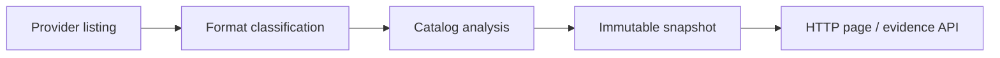

# Concepts

## The proxy is the trust boundary

The application performs **no authentication and no authorization**. It has no
login, no session, no TLS, and no notion of a permitted user. That is a
deliberate division of labour: an authentication proxy in front of it is the
only boundary, and an operator-managed `NetworkPolicy` guarantees nothing can
bypass the proxy to reach the port directly.

`TRUSTED_USER_HEADER` (default `X-Forwarded-User`) is **display-only**. The
value is rendered so a user can see who the proxy thinks they are; it never
authorizes anything and never changes what the response contains. The proxy
must strip any client-supplied value before setting its own.

In sidecar mode there is no TCP listener at all. The boundary is instead a
pod-private Unix socket plus a pod-local bearer token, both mounted into only
the two intended containers.

## Read-only by construction

Three independent layers keep the viewer harmless:

1. **The interface.** Domain code sees only list, bounded get/open, and
   stat/head. There is no write method to call.
2. **The build.** `hack/check-readonly.sh` fails on mutation-shaped
   identifiers in `cmd/` and `internal/`, and on forbidden actions in the
   shipped IAM policy templates.
3. **The credential.** The deployment credential must independently deny
   writes. This is the layer that survives a bug in the other two.

## Scan, publish, serve

A background scanner walks the configured root, the format module classifies
what it finds, and the analyzer produces a snapshot that is published
**atomically**. Readers — a page render or an API request — only ever read a
published snapshot. No HTTP handler performs provider I/O, so a slow or broken
store can never turn into a slow or broken page.

Every snapshot records its own provenance: a monotonically increasing
process-local generation ID, UTC start and completion timestamps, the provider
and format identity in redacted form, whether discovery and every required
listing completed, pages and objects examined, which safety ceilings were
reached, the age of the last complete generation, and any refresh failure
category.

**A failed refresh never replaces good evidence.** The last complete snapshot
is retained and marked stale. On the *first* failed refresh there is no
retained generation at all, so totals and generation facts are legitimately
null rather than zero.

Provider listings are not transactional. Objects can be archived or expired
while pagination is in progress, and the analyzer is written to account for
that race rather than pretend it does not exist — which is why a gap needs two
consecutive complete scans before it is confirmed.

## Bounded everything

Every ceiling exists so that failure degrades to `unknown` instead of to
unbounded memory or an unbounded page:

| Ceiling | Effect when reached |
|---|---|
| `MAX_OBJECTS_PER_SCAN` | the scan is incomplete; totals become unknown |
| compact WAL range / retained-diagnostic limits | WAL continuity becomes unknown, even if the visible segments look contiguous |
| `STORE_REQUEST_TIMEOUT` | the operation fails with a `timeout` category and the refresh is marked failed |
| `WAL_PAGE_SIZE` | the WAL browser paginates rather than expanding a huge range into rows |

## Format isolation

A repository format is not a detail of a provider, and the two never mix.
Provider adapters (`s3`, `azure`, `gcs`) turn SDK types into a neutral read
interface and stop there. Format modules (`barmancloud`, `pgbackrest`) own
their catalogs, dependency rules, and WAL layouts and never share a type whose
semantics differ between them — a pgBackRest reference chain is not a Barman
parent field.

`REPOSITORY_FORMAT` selects exactly one format. There is no auto-detection and
no fallback: object presence never compensates for a format mismatch.

## Determinism

The same snapshot and configuration produce byte-equivalent semantic output:
stable sort orders, UTC timestamps, exact integer byte counts, explicit unknown
values, and injected clocks. This is what makes cross-provider parity testable
— `make test-provider-parity` requires byte-identical normalized semantic output for the
same repository over MinIO, Azurite, and fake-gcs-server.

## Redaction

Credentials, mounted secret values, provider authorization headers, signed
URLs, SAS parameters, and raw credential-bearing SDK errors never reach logs,
responses, HTML, errors, tests, fixtures, or snapshots. Provider errors are
normalized at the adapter boundary into a small, non-sensitive vocabulary:
`unknown`, `canceled`, `timeout`, `invalid_configuration`, `authentication`,
`authorization`, `throttled`, `unavailable`, `not_found`,
`incompatible_format`, `safety_limit`.

Request logs use stable route names and never raw URLs, queries, identity
headers, or authorization headers. This is why troubleshooting here starts from
your manifest rather than from an error string — see
[troubleshooting](../operations/troubleshooting.md).
