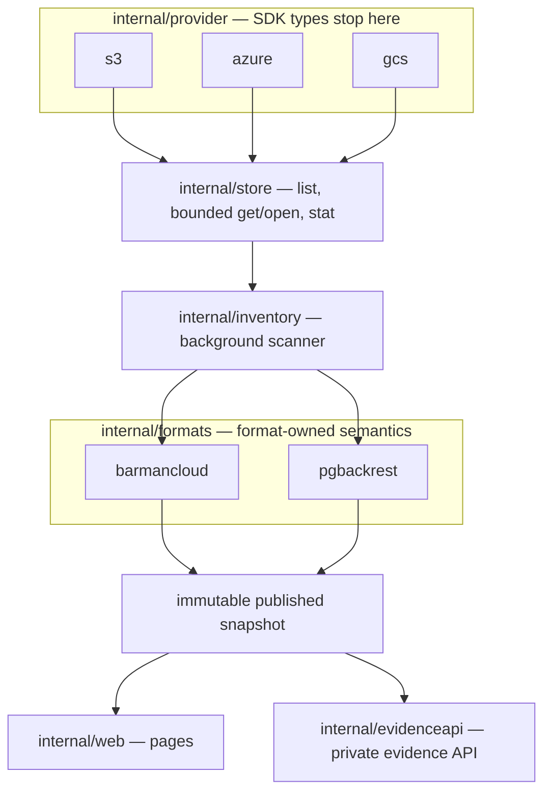

# Architecture

The shape of the codebase follows one idea: a provider knows nothing about
backups, a format knows nothing about clouds, and the domain in between is
allowed to say only what the evidence supports.

## Layers

| Layer | Package | Responsibility |
|---|---|---|
| Configuration | `internal/config` | the frozen contract, validated before anything listens; mounted secrets held in an opaque redacted type |
| Provider adapters | `internal/provider/{s3,azure,gcs,cursor}` | translate SDK calls and errors into the neutral read interface; **no SDK type escapes** |
| Read store | `internal/store` | the narrow read-only surface plus its contract tests and fake |
| Formats | `internal/formats/{barmancloud,pgbackrest}` | typed catalogs, artifact rules, WAL classification, timelines, recovery |
| Inventory | `internal/inventory` | the background scanner and the atomically published snapshot |
| Evidence | `internal/evidence`, `internal/evidenceapi` | projection into the wire vocabulary, the immutable publication engine, the authenticated Unix channel, the probe |
| Presentation | `internal/web` | the standalone pages, rendering only allowlisted fields |
| Cross-cutting | `internal/redact`, `internal/fault`, `internal/readiness` | redaction, the non-sensitive failure vocabulary, probe state |
| Composition | `internal/application`, `cmd/objectstoreviewer` | wire a runtime; the binary also carries the `probe` subcommand |

The cross-project wire vocabulary lives in a **separate Go module**,
[`api/`](https://github.com/fyannk/pgObjectStoreViewer/tree/v0.1.1/api), which is
required to have zero external module dependencies so that pgConsole and
pgtoolbox can depend on it without inheriting a cloud SDK.

## Invariants the structure enforces

- **Read-only by construction** — there is no write method on the store
  interface, and a build check fails on mutation-shaped identifiers anywhere in
  `cmd/` or `internal/`.
- **No SDK leakage** — provider types are confined to their adapter package, so
  the domain cannot accidentally depend on S3 semantics.
- **No shared backup model** — a type shared between formats must have identical
  semantics in both, or it stays format-owned. A pgBackRest reference chain is
  not a Barman parent field.
- **Bounded and cancelable** — every provider operation takes a `context.Context`
  and every collection has a ceiling that fails to `unknown`.
- **Deterministic** — stable orders, UTC times, injected clocks, exact integers,
  explicit unknowns; the same snapshot renders byte-equivalently.

## Reading order for contributors

The code and its tests are the authority. Read them in this order, and read the
tests beside each package — they encode the invariants:

1. `internal/config` — what a valid deployment is at all;
2. `internal/store` and one provider adapter — the read boundary;
3. `internal/formats/barmancloud` — the semantics that make evidence honest;
4. `internal/inventory` — scanning and atomic publication; then
5. `internal/web` or `internal/evidenceapi` — how a snapshot becomes output.

For the reasoning that the code cannot tell you, read
[Decisions](decisions.md). For the rules a change must satisfy, read
[Development](../development.md#definition-of-done) and `AGENTS.md`.

Continue with [providers](providers.md), [repository
formats](formats.md), [scanning and publication](scanning.md), the
[evidence channel](evidence-channel.md), and [Decisions](decisions.md).
